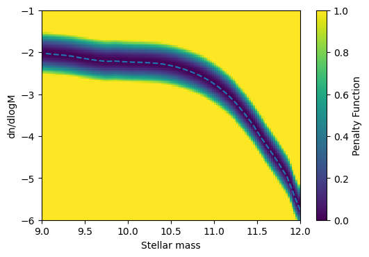

Comparing With Data
===================

To unlock the full power of emulation it
is often usefull to compare your results
with observational data. With
SWIFT-Emulator you can directly compare
the emulated outputs with the observational
data stored in `velociraptor-comparison-data`
which can be found 
`here <https://github.com/SWIFTSIM/velociraptor-comparison-data>`_.
You can also download just the required ``Vernon.hdf5`` file
`here <http://virgodb.cosma.dur.ac.uk/swift-webstorage/IOExamples/Vernon.hdf5>`_.

In this case we will again use the data from
`http://virgodb.cosma.dur.ac.uk/swift-webstorage/IOExamples/emulator_output.zip`
First we have to set up the emulator

.. code-block:: python

    from swiftemulator.io.swift import load_parameter_files, load_pipeline_outputs
    from swiftemulator.emulators.gaussian_process import GaussianProcessEmulator
    from swiftemulator.mean_models import LinearMeanModel
    from velociraptor.observations import load_observations

    from glob import glob
    from pathlib import Path
    from tqdm import tqdm
    from matplotlib.colors import Normalize

    import matplotlib.pyplot as plt
    import numpy as np
    import corner

    import os

    files = [Path(x) for x in glob("./emulator_output/input_data/*.yml")]

    filenames = {filename.stem: filename for filename in files}

    spec, parameters = load_parameter_files(
        filenames=filenames,
        parameters=[
            "EAGLEFeedback:SNII_energy_fraction_min",
            "EAGLEFeedback:SNII_energy_fraction_max",
            "EAGLEFeedback:SNII_energy_fraction_n_Z",
            "EAGLEFeedback:SNII_energy_fraction_n_0_H_p_cm3",
            "EAGLEFeedback:SNII_energy_fraction_n_n",
            "EAGLEAGN:coupling_efficiency",
            "EAGLEAGN:viscous_alpha",
            "EAGLEAGN:AGN_delta_T_K",
        ],
        log_parameters=[
            "EAGLEAGN:AGN_delta_T_K",
            "EAGLEAGN:viscous_alpha",
            "EAGLEAGN:coupling_efficiency",
            "EAGLEFeedback:SNII_energy_fraction_n_0_H_p_cm3",
        ],
        parameter_printable_names=[
            "$f_{\\rm E, min}$",
            "$f_{\\rm E, max}$",
            "$n_{Z}$",
            "$\\log_{10}$ $n_{\\rm H, 0}$",
            "$n_{n}$",
            "$\\log_{10}$ $C_{\\rm eff}$",
            "$\\log_{10}$ $\\alpha_{\\rm V}$",
            "AGN $\\log_{10}$ $\\Delta T$",
        ],
    )

    value_files = [Path(x) for x in glob("./emulator_output/output_data/*.yml")]

    filenames = {filename.stem: filename for filename in value_files}

    values, units = load_pipeline_outputs(
        filenames=filenames,
        scaling_relations=["stellar_mass_function_100"],
        log_independent=["stellar_mass_function_100"],
        log_dependent=["stellar_mass_function_100"],
    )

    # Train an emulator for the space.
    scaling_relation = values["stellar_mass_function_100"]
    scaling_relation_units = units["stellar_mass_function_100"]

    emulator = GaussianProcessEmulator()
    emulator.fit_model(model_specification=spec,
        model_parameters=parameters,
        model_values=scaling_relation,
    )

In this case we are gonna look at the stellar
mass function. To compare we load the calibration
SMF for EAGLE-XL.

.. code-block:: python

    observation = load_observations(
        "../velociraptor-comparison-data/data/GalaxyStellarMassFunction/Vernon.hdf5"
    )[0]

Penalty Functions
-----------------

There is a large selection of "Penalty" functions
available. We define a penalty function as an
analogous to a likelihood.

.. math::
    \mathcal{L} = 1 -  P(x,\theta),

where :math:`\mathcal{L}` is the likelihood and
:math:`P(x,\theta)` is the accompanying penalty
function.

As an example we will use an L2 norm. This will
calculate the mean squared distance between the
emulator and the data. 

.. code-block:: python

    from swiftemulator.comparison.penalty import L2PenaltyCalculator
    from unyt import Msun, Mpc

    L2_penalty = L2PenaltyCalculator(offset = 0.5, lower=9,upper=12)
    L2_penalty.register_observation(observation,log_independent=True
                                ,log_dependent=True
                                ,independent_units=Msun
                                ,dependent_units=Mpc**-3)

    L2_penalty.plot_penalty(9,12,-6,-1,"penalty_example",x_label="Stellar mass",y_label="dn/dlogM")

Now we can combine this with the emulator to compare models
in terms of how good they fit the data. Without using the
emulator we can use interpolation to be able to quickly check
which node of the parameter space best fits the data via
:meth:`swiftemulator.comparison.penalty.L2PenaltyCalculator.penalties`

.. code-block:: python

    all_penalties = L2_penalty.penalties(emulator.model_values,np.mean)

    all_penalties_array = []
    node_number = []
    for key in all_penalties.keys():
        all_penalties_array.append(all_penalties[key])
        node_number.append(int(key))
        
    print("Best fit node = ",node_number[np.argmin(all_penalties_array)])

.. code-block:: python

    Best fit node =  107

If we want to check the simulation that is best without rerunning
anything we can use node 107. In general we can use this to check
not just models at the nodes, but use the emulator to check the
complete parameter range. Starting with node 107, let's see if
we can improve the fit by chaning one of the parameters.

.. code-block:: python

    predictparams = emulator.model_parameters["107"].copy()
    x_to_predict = np.log10(L2_penalty.observation.x.value)
    pred, pred_var = emulator.predict_values(x_to_predict, predictparams)

    print("Mean Penalty of node 107 = ",np.mean(L2_penalty.penalty(x_to_predict,pred)))

    #Let's change one of the parameters and see if it improves the fit
    predictparams["EAGLEFeedback:SNII_energy_fraction_max"] = 1
    x_to_predict = np.log10(L2_penalty.observation.x.value)
    pred, pred_var = emulator.predict_values(x_to_predict, predictparams)

    print("Mean after change = ",np.mean(L2_penalty.penalty(x_to_predict,pred)))

.. code-block:: python

    Mean Penalty of node 107 =  0.21988119507121354
    Mean after change =  0.3344361855742612

This change makes the fit worse, so no luck. In general you would
not do this by hand, but use for example MCMC to sample all the
parameters.

Defining New Penalty Functions
------------------------------

What you want out of these penalty functions can vary wildy,
but it is very easy to define your own. There is a large set 
of functions available within
:meth:`swiftemulator.comparison.penalty`. It is also possible
to add your own functions. The base class
:meth:`swiftemulator.comparison.penalty.PenaltyCalculator`
covers the most important part, which is loading and
interpolating the data. You can then add whichever calculattion
of the penalties you want. In the example below we create a
function that is Gaussian weighted, with a constent error
term.

.. code-block:: python

    from swiftemulator.comparison.penalty import PenaltyCalculator
    import unyt

    class ExamplePenaltyCalculator(PenaltyCalculator):
        
        def penalty(self,independent, dependent, dependent_error):
            #We can use the observational data from the base class.
            #We calculate the observational y-values to compare with
            #from the interpolated observations.
            obs_dependent = self.interpolator_values(independent)
            
            penalties = np.exp(-np.abs(dependent - obs_dependent)**2/0.1)
            return penalties
        
    my_penalty = ExamplePenaltyCalculator()
    my_penalty.register_observation(observation,log_independent=True,log_dependent=True
                                ,independent_units=Msun,dependent_units=Mpc**-3)

    my_penalty.plot_penalty(9,12,-6,-1,"my_penalty",x_label="Stellar mass",y_label="dn/dlogM")

For the simplest models you can also still use the `plot_penalty`
functionality. There are also PF's available that use the
errors on the data, for example
:meth:`swiftemulator.comparison.penalty.GaussianDataErrorsPenaltyCalculator`.
When creating new penalty functions you can use different parts 
of already existing ones to make the process very easy.
