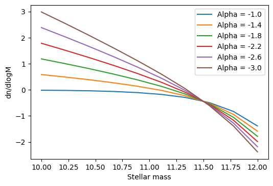

Analysis tools
==============

Here we will outline some of the available
tools that can help inspect the performance
of the emulator. The example data will be
the Schecter function example:

.. code-block:: python

    import swiftemulator as se
    from swiftemulator.emulators import gaussian_process
    import numpy as np

    def log_schecter_function(log_M, log_M_star, alpha):
        M = 10 ** log_M
        M_star = 10 ** log_M_star
        return np.log10( (1 / M_star) * (M / M_star) ** alpha * np.exp(- M / M_star ))

    model_specification = se.ModelSpecification(
        number_of_parameters=2,
        parameter_names=["log_M_star","alpha"],
        parameter_limits=[[11.,12.],[-1.,-3.]],
        parameter_printable_names=["Mass at knee","Low mass slope"],
    )

    log_M_star = np.random.uniform(11., 12., 100)
    alpha      = np.random.uniform(-1., -3., 100)

    modelparameters = {}
    for unique_identifier in range(100):
        modelparameters[unique_identifier] = {"log_M_star": log_M_star[unique_identifier],
                                            "alpha": alpha[unique_identifier]}

    model_parameters = se.ModelParameters(model_parameters=modelparameters)

    modelvalues = {}
    for unique_identifier in range(100):
        independent = np.linspace(10,12,10)
        dependent = log_schecter_function(independent,
                                        log_M_star[unique_identifier],
                                        alpha[unique_identifier])
        dependent_error = 0.02 * dependent
        modelvalues[unique_identifier] = {"independent": independent,
                                        "dependent": dependent,
                                        "dependent_error": dependent_error}

    model_values = se.ModelValues(model_values=modelvalues)

    schecter_emulator = gaussian_process.GaussianProcessEmulator()
    schecter_emulator.fit_model(model_specification=model_specification,
                                model_parameters=model_parameters,
                                model_values=model_values)

Cross checks
------------

To set up a cross check, the emulator is
trained on all but one of the input data-sets.
The resulting emulator can then be compared
against the model that was left out.

Cross checks are the main way of quantifying
emulator performance in the absence of validation
data. When emulating via cosmological simulations
it is likely to be very expensive to generate a 
validation dataset of sufficient size. for cases
like this SWIFT-Emulator has an easy way of setting up
cross-checks.

The :meth:`swiftemulator.sensitivity.cross\_check`
object acts identically to :meth:`swiftemulator.emulators.gaussian\_process`
and takes the same inputs. By setting the cross-checks
up in this way you can directly compare the results
with the main GP that you use for predictions.

.. code-block:: python

    from swiftemulator.sensitivity import cross_check

    schecter_ccheck = cross_check.CrossCheck()
    schecter_ccheck.build_emulators(model_specification=model_specification,
                            model_parameters=model_parameters,
                            model_values=model_values)

In this case `build_emulators` takes the place of `fit_model`.
Note that build_emulators now creates N independent trained
emulators, where N is the number of models, so this can take
quite a long time. For this example the amount of models was
reduced from 100 to 20.

Once the emulators have been build there are some inherent
tools to have a look at the result (see :meth:`swiftemulator.sensitivity.cross\_check`).
We will use `build_mocked_model_values_original_independent()`
to compare the cross-check predictions with the original
data.

.. code-block:: python

    import matplotlib.pyplot as plt

    data_by_cc = schecter_ccheck.build_mocked_model_values_original_independent()

    for unique_identifier in range(20):
        cc_over_og = data_by_cc[unique_identifier]["dependent"] / \
                    model_values[unique_identifier]["dependent"]
        plt.plot(data_by_cc[unique_identifier]["independent"],cc_over_og)
        plt.xlabel("Mass")
        plt.ylabel("Cross-check / Truth")
        
    plt.savefig("Cross_check_accuracy.png",dpi=200)

.. image:: Cross_check_accuracy.png

Just with a few line we are able to quantify how accurate
the emulator is. Also note that any `ModelValues` container
can be parsed as if it is a dictionary.

Sweeps Of Parameter Space
-------------------------

One of the advantages of using emulators is that it supplies
you with a fully continuous model of the given function.
Besides fitting the parameters it is often interesting to see
the effect of changing a single parameter, by doing a sweep.

This is implemented into the SWIFT-Emulator with 
:meth:`swiftemulator.mocking.mock\_sweep`.

.. code-block:: python

    from swiftemulator.mocking import mock_sweep

    center = {"log_M_star": 11.5, "alpha": -2.0}

    Mock_values, Mock_parameters = mock_sweep(schecter_emulator
                                          ,model_specification
                                          ,6,"alpha",center)

    for mock_name in Mock_values.keys():
        plt.plot(Mock_values[mock_name]["independent"],
                Mock_values[mock_name]["dependent"],
                label = "Alpha = " +str(Mock_parameters[mock_name]["alpha"])[:4])

    plt.xlabel("Stellar mass")
    plt.ylabel("dn/dlogM")    
    plt.legend()
    plt.savefig("parameter_sweep.png",dpi=200)

`mock_sweep` returns the values and parameter of the 
sweep as `ModelValues` and `ModelParameters`
containers, that are easy to parse. 

Model Parameters Features
-------------------------

This highlights two small functions that are attached to
the :meth:`swiftemulator.backend.model\_parameters`
object. The first is the ability to generate a quick plot
of the experimental design using :mod:`corner`.

.. code-block:: python

    model_parameters.plot_model(model_specification)

.. image:: experimental_design.png

Note that the axis label used here are the one passed to
the model specification. This can be used to have a quick
look at whether your space is well sampled.

After finding a set of best fit model parameters it is
sometimes usefull to see if there are any individual model
that has similar values. `find_closest_model` takes a
dictionary of input values and finds the training model
that is closets to those values. 

.. code-block:: python

    best_model = {"log_M_star": 11.3, "alpha": -2.1}

    model_parameters.find_closest_model(best_model,number_of_close_models=5)

which outputs

.. code-block:: python

    ([2, 12, 18, 19, 3],
    [{'log_M_star': 11.26347510702813, 'alpha': -1.9614226414699145},
    {'log_M_star': 11.507944778215956, 'alpha': -1.9818583963792449},
    {'log_M_star': 11.19527147203741, 'alpha': -1.8330160108907092},
    {'log_M_star': 11.033961506507945, 'alpha': -2.275313906753826},
    {'log_M_star': 11.67912812994198, 'alpha': -2.0664526312834353}])

It returns a list with the `unique_identifier` of each close
model, and the model parameters belonging to that model. This
can be used to explore the models close to you best fit model,
for example to check how well sampled that part of parameter
space is.

Checking Hyperparameters
------------------------

In general one should not look at the hyperparameters. They
should only be used as a diagnostic when the emulator is
giving strange results. The SWIFT-Emulator provides an
easy way to check the parameterspace of the hyperparameters.
The hyperparameters are optimised to using the
marginalised likelihood, so we can inspect how well converged
they are by looking at the probability distribution of each
individual hyperparameter. This is done via
:meth:`swiftemulator.emulators.gaussian\_process\_mcmc`.
In this case MCMC implies the use of Markov chian
Monte Carlo (via :mod:`emcee`) to find the best
hyperparameters, allowing us to look at the complete
parameter space.

.. code-block:: python

    from swiftemulator.emulators import gaussian_process_mcmc
    schecter_emulator_mcmc = gaussian_process_mcmc.GaussianProcessEmulatorMCMC(burn_in_steps=1
                                                                              ,mcmc_steps=1000)
    schecter_emulator_mcmc.fit_model(model_specification=model_specification,
                            model_parameters=model_parameters,
                            model_values=model_values)

    schecter_emulator_mcmc.plot_hyperparameter_distribution()

.. image:: hyperparameters.png

This method is a lot slower than the default hyperparameter
optimisation, and may take some time to compute. The main
take away from plots like this is to see whether the
hyperparameters are converged, and whether they are 
consistent with the faster optimisation method.