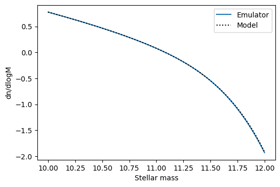

.. _getting_started:

Getting Started
===============

In this section the basics of using the SWIFT-Emulator will
be explained, with examples of how to make your first GP 
predictions.

Installation
------------

The package can be installed easily from PyPI under the name `swiftemulator`,
so:

``pip3 install swiftemulator``

This will install all necessary dependencies.

The package can be installed from source, by cloning the repository and
then using `pip install -e .` for development purposes.

Requirements
------------

The package requires a number of numerical and experimental design packages.
These have been tested (and are continuously tested) using GitHub actions CI
to use the latest versions available on PyPI. See `requirements.txt` for
details for the packages required to develop SWIFT Emulator. The packages
will be installed automatically by `pip` when installing from PyPI.

Loading data
------------

In the way we set up the emulator, loading the data is the
most cumbersome part of emulation. Once everything is in the
right format the emulation itself will be very easy.

At the basis of the SWIFT-Emulator lies the ability to train
a Gaussian process (GP) based on a set of training data. As 
the main goal is emulating scaling relations on the back of 
hydro simulations you should think of the emulation being in 
the following form

.. math::
    GP(y,x,\theta),

where we want to predict the dependent :math:`y` as a function 
of the independent :math:`x` and model parameters :math:`\theta`.
The distinction between :math:`x` and :math:`\theta` is made
to distinquish the relation that can be obtained from a single
simulation output (Like the number density of galaxies as a 
function of their stellar mass, where y is the number density
and x the stellar mass) from the parameters that span different
outputs (Like redshift, or AGN feedback strength). For this
example we will predict the stellar mass function using some
data generated with a Schecter function

.. code-block:: python

    import swiftemulator as se
    import numpy as np

    def log_schecter_function(log_M, log_M_star, alpha):
        M = 10 ** log_M
        M_star = 10 ** log_M_star
        return np.log10( (1 / M_star) * (M / M_star) ** alpha * np.exp(- M / M_star ))

where we set the normalisation to unity. In this case we will 
use `log_M` as the independent, while `M_star` and `alpha` are
our model parameters. The choice to emulate in log space is 
important, this massively decreases the dynamic range which
makes it a lot easier for a Gaussian process to emulate
accurately.

In order to get the data in the correct form we need to
define three containers. We start by specifying some of the 
basic information of our model. This is done via :meth:`swiftemulator.backend.model\_specification`.

.. code-block:: python

    model_specification = se.ModelSpecification(
        number_of_parameters=2,
        parameter_names=["log_M_star","alpha"],
        parameter_limits=[[11.,12.],[-1.,-3.]],
        parameter_printable_names=["Mass at knee","Low mass slope"],
    )

The mode specification is used to store some of the metadata
of the training set.

Lets assume our training set consists of 100 simulations where
our model parameters are randomly sampled

.. code-block:: python

    log_M_star = np.random.uniform(11., 12., 100)
    alpha      = np.random.uniform(-1., -3., 100)

This can be used to set up the second container, which 
contains the model parameters. For each unique model, named
by `unique_identifier`, we store the values in a dictionary

.. code-block:: python

    modelparameters = {}
    for unique_identifier in range(100):
        modelparameters[unique_identifier] = {"log_M_star": log_M_star[unique_identifier],
                                            "alpha": alpha[unique_identifier]}
        
    model_parameters = se.ModelParameters(model_parameters=modelparameters)

The `unique_identifier` is really important, as this will be used to
link the model parameters to the model values. There are some major
advantages to splitting this up. By splitting the model from the 
scaling relation we only have to define the model once, allowing
us to attach as many relations to it as we want.

Final thing is adding the values of the function we want to emulate.
This is done in a similar way to how we add the model parameters,
except that we now attach a complete array for each model.

.. code-block:: python

    modelvalues = {}
    for unique_identifier in range(100):
        independent = np.linspace(10,12,10)
        dependent = log_schecter_function(independent, 
                                          log_M_star[unique_identifier], 
                                          alpha[unique_identifier])
        dependent_error = 0.02 * dependent
        modelvalues[unique_identifier] = {"independent": independent, 
                                        "dependent": dependent, 
                                        "dependent_error": dependent_error}
        
    model_values = se.ModelValues(model_values=modelvalues)

For the model values it is important that you use the names
`independent`, `dependent` and `dependent_error` for `x`, `y`
and `y_err` respectively. These specific names are used when 
setting up the emulator

Training the emulator
---------------------

After setting up de model containers, training the emulator becomes
very simple. First we create an empty GP, which we can then train
on the data we have just loaded.

.. code-block:: python

    from swiftemulator.emulators import gaussian_process
    schecter_emulator = gaussian_process.GaussianProcessEmulator()
    schecter_emulator.fit_model(model_specification=model_specification,
                                model_parameters=model_parameters,
                                model_values=model_values)

This might take a little bit of time. At this point the GP is
fully trained and can be used to make predictions. There are 
a lot more options when setting up the GP, like indlucing a 
model for mean, but if your input is smooth this is likely
all you will need.

Making predictions
------------------

The real reason to use an emulator is to eventually predict
the shape of the scaling relation continuously over the
parameterspace. Just like training the emulator, making
predictions is extremely simple

.. code-block:: python

    predictparams = {"log_M_star": 11.5, "alpha": -2}
    predict_x = np.linspace(10,12,100)

    pred, pred_var = schecter_emulator.predict_values(predict_x, predictparams)

The main thing to keep in mind is that you give the
model parameters as a dictionary again, with the same 
names as how they are defined in the `model_parameters`.
In this case we can directly compare with the original
model.

.. code-block:: python

    import matplotlib.pyplot as plt
    plt.plot(predict_x,pred,label="Emulator")
    plt.plot(predict_x,log_schecter_function(predict_x,
                                            predictparams["log_M_star"]
                                            ,predictparams["alpha"])
            ,color="black",ls=":",label="Model")
    plt.xlabel("Stellar mass")
    plt.ylabel("dn/dlogM")
    plt.legend()

Which shows that the emulator can predict the model with
high accuracy.

This covers the most basic way to use SWIFT-Emulator and
should give a good baseline for using some of the
additional features it offers.